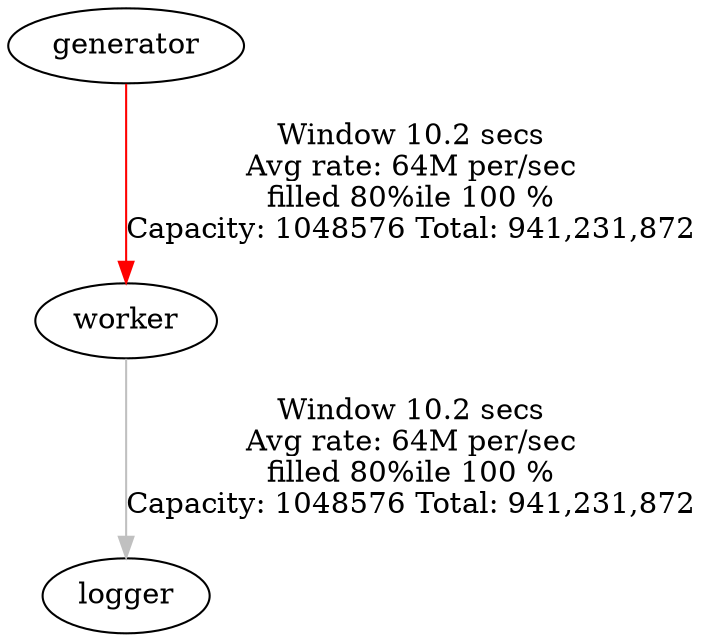

# Steady State Performant

> **Mechanically Sympathetic, Cache-Friendly High-Throughput Actors**

This project demonstrates advanced, real-world performance engineering with the [`steady_state`](https://github.com/steady-stack/steady-state) actor framework.  
It builds on the `minimum` and `standard` lessons, introducing **cache-friendly batching**, **very large channels**, and **mechanically sympathetic** flow control for enterprise-grade throughput.

---

## 🚀 What Makes This "Performant"?

This lesson introduces three key optimizations for maximum throughput:

1. **Extremely Large Channel Buffers**  
   Channels are sized to **over one million messages** (`1 << 20` = 1,048,576), reducing backpressure and synchronization overhead to near zero.

2. **Double-Buffer Batching**  
   Each actor processes *half* of a channel’s capacity in a single batch (over 500,000 messages at a time), while the other half is being filled by upstream actors.  
   The actor alternates between two contiguous memory regions ("slices"), always processing as much as possible in a tight, cache-friendly loop. This ensures that producers and consumers are always working in parallel, maximizing CPU and memory bus utilization, and minimizing context switches.

3. **Zero-Copy Processing**  
   For those willing to invest in careful design, the framework exposes a **zero-copy API**.  
   Instead of copying data into intermediate buffers, actors operate directly on channel memory using paired `peek_slice`/`poke_slice` APIs. This allows for direct, in-place transformation of messages, eliminating all intermediate allocations and copies.  
   Zero-copy is the lowest-level, highest-performance mode—ideal for advanced users who want to squeeze out every last nanosecond, at the cost of more complex code and careful attention to memory layout and lifetimes.

---

## 🏗️ System Architecture

**Pipeline:**

```
Generator (batch: 524,288) → Worker (batch: 524,288 x 2, or zero-copy) → Logger (batch: large)
    eartbeat (burst: 1024) ↗
```

- **Generator**: Produces values in very large batches, filling half the channel at a time.
- **Heartbeat**: Triggers worker batches in bursts, coordinating timing.
- **Worker**: Consumes a full channel (two half-batches, a million messages) before yielding, converting values to FizzBuzz messages.
   - Can use either double-buffering (copying into a pre-allocated buffer) or zero-copy (operating directly on channel memory).
- **Logger**: Processes large batches, tracking statistics and throughput.

---

## 🧠 Performance Concepts

### Why Extremely Large Channels?

- **Reduces contention**: Fewer synchronization points between producers and consumers.
- **Absorbs bursts**: Handles spikes in production or consumption without stalling.
- **Enables massive batching**: Allows actors to process huge, contiguous memory regions, maximizing cache and memory bus efficiency.

### Double-Buffer Batching (Refined)

- **Producer** fills half the channel while **consumer** processes the other half.
- **Consumer** waits for at least half-full, then processes in a single, cache-friendly loop.
- The actor alternates between two memory regions ("slices"), always processing as much as possible in a tight, predictable loop.
- **After consuming one half**, the consumer immediately checks if the other half is ready, processing both halves before yielding.
- **Result**: Maximizes cache line reuse, minimizes context switches, and keeps both ends of the pipeline busy.
- **Implementation**: Uses pre-allocated buffers for batch processing, ensuring zero heap allocations on the hot path.

### Zero-Copy Processing

- **No intermediate buffers**: Actors operate directly on the channel’s memory using `peek_slice` and `poke_slice`.
- **Direct transformation**: Data is read and written in-place, eliminating all copying and allocation overhead.
- **Advanced usage**: Requires careful handling of memory layout, lifetimes, and batch boundaries.
- **Maximum performance**: This is the lowest-level, most mechanically sympathetic mode—ideal for workloads where every cycle counts.
- **Tradeoff**: Code is more complex and less forgiving, but the performance gains can be substantial, especially for large, predictable workloads.

---

## ⚙️ Default Runtime Parameters

The system is designed to run at high speed by default:

- **Heartbeat rate:** 2 ms between operations (`--rate 2`)
- **Beats (iterations):** 30,000 (`--beats 30000`)

This means the system will run for about one minute, processing billions of messages in that time.

---

## 📊 Real-World Telemetry: True Throughput

Below is a real snapshot from the built-in telemetry server, running on a modern i5 CPU.  
This shows the system sustaining **over 128 million messages per second** through the main pipeline, with all actors and channels operating at maximum efficiency.



**What does this show?**
- The generator and worker are moving over **128 million messages per second**.
- Channels are running at 100% fill (full double-buffering).
- CPU load is moderate, showing the design is not just fast, but efficient and scalable.

---

## 🏁 Example Output

After running for about a minute with default settings, you will see output like:

```
Logger: 9613344768 messages processed (F:2563558604, B:1281779302, FB:640889652, V:5127117210)
Logger: 9630121984 messages processed (F:2568032529, B:1284016264, FB:642008133, V:5136065058)
Logger: 9646899200 messages processed (F:2572506453, B:1286253226, FB:643126614, V:5145012907)
Generator shutting down. Total generated: 9652662016
Worker shutting down. Heartbeats: 30001, Values: 9652662016, Messages: 9652662016
Logger shutting down. Total: 9652662016 (F:2574043204, B:1287021602, FB:643510802, V:5148086408)
```

This demonstrates the system processed **over 9.6 billion messages** in about a minute, with all actors and channels operating at full efficiency.

---

## 🏎️ Performance Features

- **Batch Processing**: Over 500,000 messages per operation.
- **Zero-Allocation Hot Paths**: Pre-allocated buffers reused every cycle (double-buffer), or no buffers at all (zero-copy).
- **Zero-Copy Support**: For advanced users, direct in-place transformation with no intermediate allocations or copies.
- **Real-Time Metrics**: Throughput, batch efficiency, and memory usage tracked live.
- **Actor Teams**: Lightweight actors share threads for optimal core utilization.
- **Backpressure Management**: Large buffers and batch-aware flow control prevent stalls.

---

## 📈 Throughput Scaling

| Version                        | Messages/sec         | Batch Size           | Channel Capacity | Memory Usage |
|--------------------------------|---------------------|----------------------|----------------|-------------|
| Robust                         | ~1,000              | 1                    | 64             | Minimal    |
| Standard                       | ~10,000             | 16–64                | 1024           | Minimal    |
| **Performant (Double Buffer)** | **50–200M**         | 524,288–1,048,576    | 1,048,576      | Constant    |
| **Performant (Zero Copy)**     | **150–300M**        | (Direct, in-place)   | 1,048,576      | Minimal     |

---

## 🚀 Double Buffer vs Zero Copy

- **Double Buffer**:  
  The performant double-buffer implementation can sustain **50–200 million messages per second** on modern hardware. This approach is robust, cache-friendly, and easy to reason about, making it a great default for most high-throughput workloads.

- **Zero Copy**:  
  For those who need to push the limits, the zero-copy mode can reach **150–300 million messages per second**. This mode eliminates all intermediate allocations and copies, operating directly on channel memory. It requires more careful code, but delivers the highest possible throughput for workloads that can take advantage of it.
  *These are initial numbers, future versions will probably have significantly higher values*.
---

## 🛠️ Usage

#### Telemetry
- Telemetry on http://127.0.0.1:9900  (human readable)
- Telemetry on http://127.0.0.1:9900/graph.dot (graph file)

```bash
# Run with default high-speed settings (2ms heartbeat, 30,000 beats)
cargo run

# Custom rate and beats
cargo run -- --rate 10 --beats 1000

# Performance testing with metrics
RUST_LOG=trace cargo run -- --rate 50 --beats 500
```

To enable zero-copy mode, set the `use_double_buffer` flag to `false` in `main.rs`.  
This will switch the worker to the zero-copy implementation, demonstrating the absolute lowest-latency, highest-throughput path.

---

## 🎯 Key Takeaways

- **Batching** and **very large channels** are essential for high-throughput actor systems.
- **Double-buffering** keeps both producer and consumer busy, maximizing hardware efficiency, and can reach 50–200M messages/sec.
- **Zero-copy** mode eliminates all intermediate allocations and copies, delivering 150–300M messages/sec for those willing to manage the complexity.
- **Full-channel consumption** aligns with CPU cache and memory bus design for peak performance.
- **Mechanically sympathetic** code is not just fast—it’s robust under real-world load.

---

## 📚 Next Steps

- Try adjusting channel sizes and batch sizes to see their effect on throughput.
- Explore the `steady_state` metrics dashboard for real-time performance insights.
- Compare with the `minimum` and `standard` lessons to see the impact of each optimization.
- Experiment with zero-copy mode for ultimate performance, and study the code to understand the tradeoffs and requirements.

When reviewing the source code, look for //#!#// which demonstrate key ideas you need to know.
